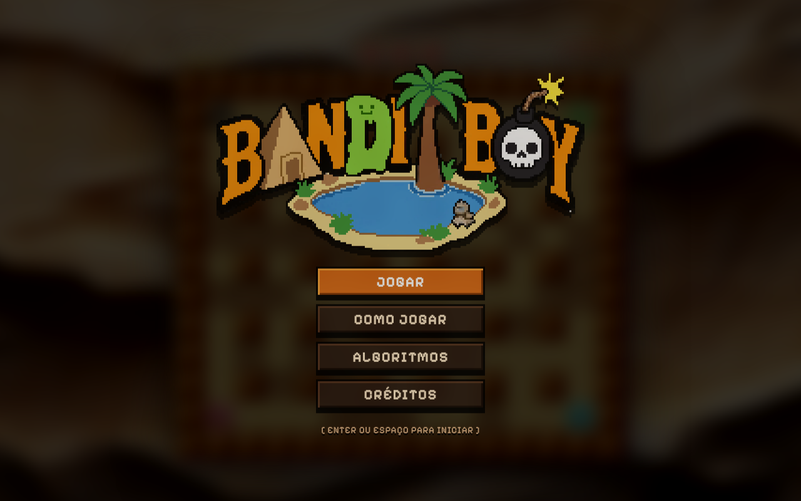
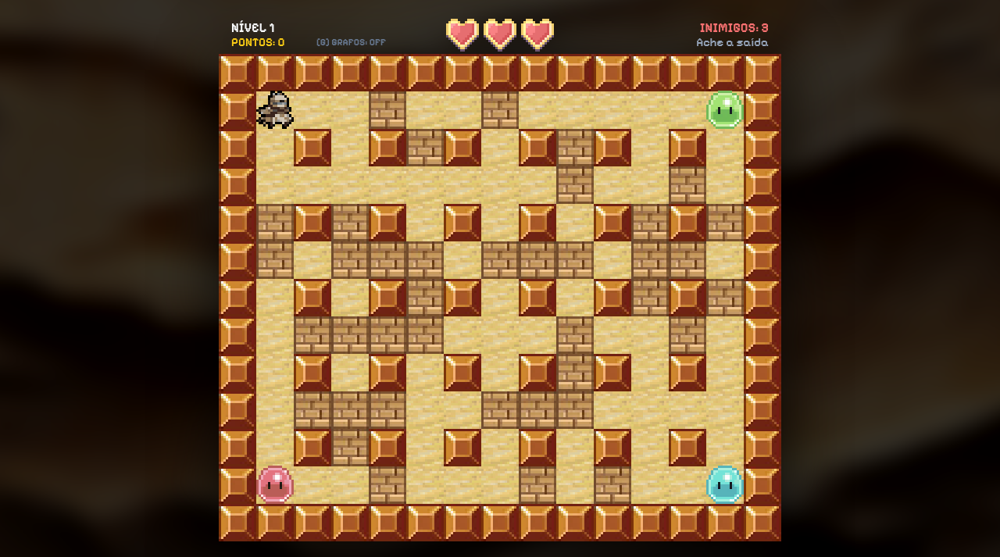
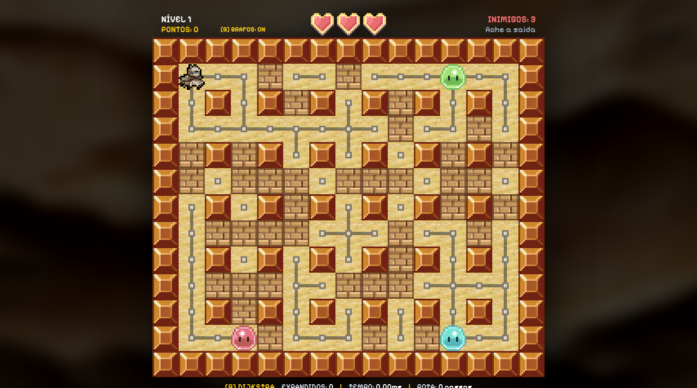

<p align="center">
  
</p>

# Bandit Boy - Grupo 6

Número da Lista: 1<br>
Conteúdo da Disciplina: Grafos<br>

## Alunos

| Matrícula | Aluno |
| :---: | :--- |
| 24/1011027 | Eduardo Lôbo Moreira |
| 24/1041302 | Hugo Freitas Silva |

## Sobre

O **Bandit Boy** é uma implementação arcade do clássico Bomberman 2D desenvolvida para a disciplina de Projeto de Algoritmos da Universidade de Brasília (UnB). O objetivo do projeto é aplicar algoritmos de busca e menor caminho em Teoria dos Grafos na tomada de decisão e inteligência artificial dos inimigos em um labirinto dinâmico.

### Como funciona

- **Modelagem do Grafo ($G = (V, E)$):** A grade do mapa (15 × 13 células) é modelada como um grafo não-direcionado em que cada célula vazia transitável representa um vértice ($V$), e as movimentações ortogonais vizinhas (cima, baixo, esquerda, direita) representam arestas com peso unitário ($w = 1$). Paredes de pedra são obstáculos estáticos e intransponíveis.
- **Grafo Dinâmico:** Blocos de tijolos bloqueiam arestas temporariamente. Quando uma dinamite destrói um bloco de tijolo, novas arestas são abertas no grafo em tempo de execução, recalculando instantaneamente as rotas de passagem.
- **Algoritmos de Menor Caminho:**
  - **Dijkstra (Fases Ímpares):** Busca de custo uniforme com heurística nula ($h(n) = 0$). O algoritmo expande nós radialmente a partir da origem, cobrindo o labirinto até encontrar o jogador.
  - **A\* (Fases Pares):** Busca informada guiada pela Heurística Admissível de Manhattan ($f(n) = g(n) + h(n)$). Por ser admissível em grade ortogonal sem diagonais, encontra o caminho ótimo explorando substancialmente menos vértices que a busca uniforme.
- **Modo de Inspeção Visual (`G`):** Pressionando a tecla `G` durante a partida, o jogo exibe diretamente sobre o Canvas os vértices transitáveis, as arestas ativas, os nós visitados pelo algoritmo e a rota traçada para cada slime, além de um painel inferior com métricas em tempo real (algoritmo ativo, quantidade de nós expandidos, tempo de execução da busca em milissegundos e passos da rota).
- **Mecânicas Arcade:** O jogador deve desviar dos slimes, destruir blocos com bombas, encontrar a saída secreta e eliminar todos os inimigos da arena para abrir a porta para a fase seguinte.

## Screenshots

### Tela Inicial



### Partida em Andamento



### Modo de Inspeção de Grafos e Métricas



## Instalação

**Linguagem:** TypeScript<br>
**Framework:** Svelte 5 (Runes)<br>

### Pré-requisitos

- **Node.js** (versão 18 ou superior)
- **npm**

### Comandos de Execução

1. Clone o repositório:

```bash
git clone https://github.com/projeto-de-algoritmos-2026/G6_Grafos_PA-26.2.git
cd G6_Grafos_PA-26.2
```

1. Instale as dependências do projeto:

```bash
npm install
```

1. Inicie o servidor de desenvolvimento:

```bash
npm run dev
```

O jogo estará disponível no navegador em: `http://localhost:5173/`

## Uso

1. Na tela inicial, pressione **Enter** ou **Espaço** (ou clique em **JOGAR**) para iniciar a partida.
2. Controles do jogador:
   - **`W` `A` `S` `D`** ou **`Setas direcionais`**: Movimentar o Bandit pelo labirinto.
   - **`Espaço`**: Plantar dinamite no chão (pavio queima por 3 segundos antes de explodir).
   - **Empurrão**: Ande contra a dinamite para chutá-la pelo corredor.
   - **`G`**: Ativar / desativar a camada visual de inspeção de grafos e métricas de busca.
3. Para passar de fase:
   - Destrua blocos de tijolo para encontrar a porta secreta.
   - Elimine todos os slimes da arena para destrancar a porta.
   - Entre na saída aberta para avançar para o próximo nível (preservando a vida restante).

## Outros

### Vídeo de Apresentação

- [Vídeo de Apresentação no YouTube](https://youtu.be/)

### Comandos Adicionais

- Verificação de tipos (TypeScript + Svelte):

```bash
npm run check
```

- Geração do bundle de produção:

```bash
npm run build
```

- Deploy no GitHub Pages:

```bash
npm run deploy
```

### Tecnologias e Recursos

- **Renderização:** HTML5 Canvas 2D (`imageSmoothingEnabled = false`, escala nativa 3x).
- **Arte:** Pixel Art própria 16×16 ampliada em 3× (células de 48 × 48 px), sem mixels, acompanhada de partículas para poeira, impactos, faíscas de pavio e explosões.
- **Transição de Níveis:** Rotação dinâmica de paleta cromática harmônica a cada fase.
